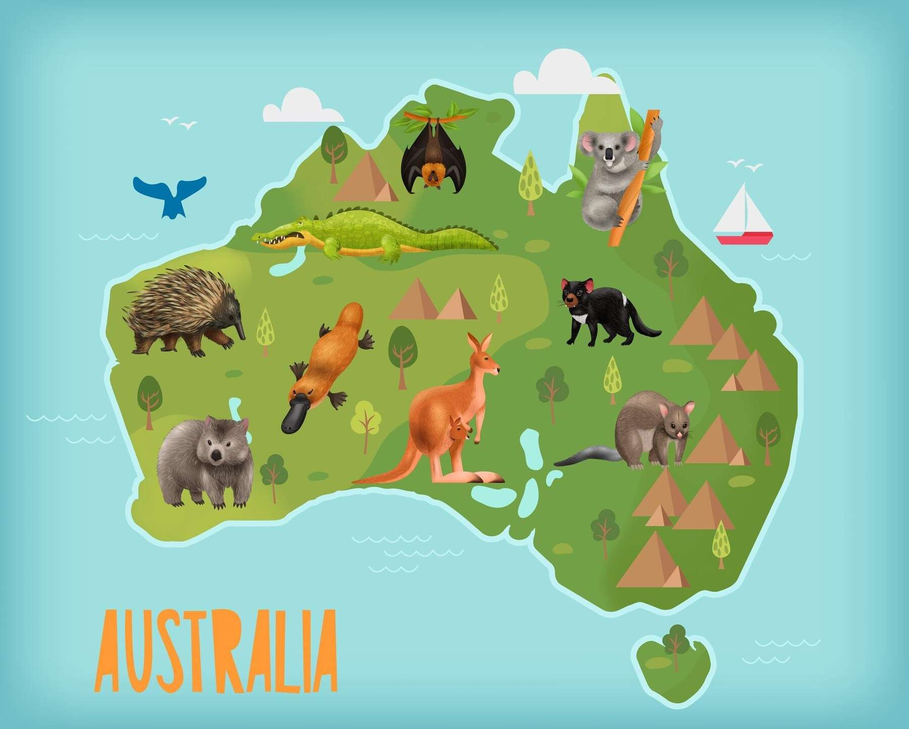
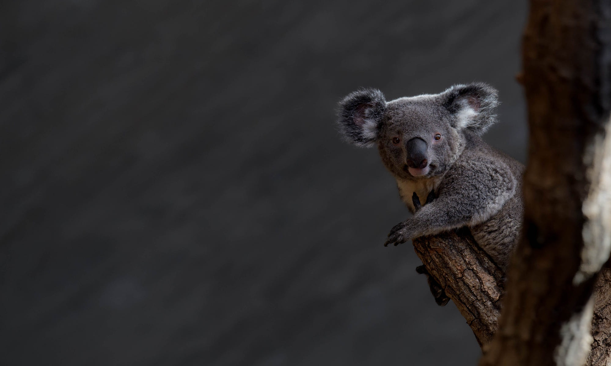
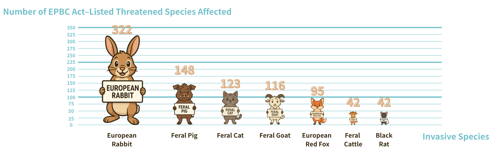

# LifePrevention Showcase

LifePrevention is an educational web application designed to help younger audiences learn about Australian wildlife and invasive species through interactive storytelling, quizzes, species exploration, mapping, and gameplay.

## Project Overview

The project combines education and interaction to make environmental awareness more engaging for children. It uses a playful interface, story-driven learning, and lightweight gamification to introduce concepts such as native species, invasive species, habitat impact, and wildlife protection in Australia.

## Key Features

- Story mode with image-based animal stories
- Species collection with native and invasive filtering
- Quiz flows, including AI-generated questions
- Interactive browser mini-game with score tracking
- Sightings map using real wildlife occurrence data
- Live2D chat assistant with text and voice interaction
- Mobile-friendly frontend built with Vue

## Preview

### Landing Experience

### Species Exploration

### Learning Content Visual

## Tech Stack

- Vue 3
- Vite
- Vue Router
- PrimeVue
- Tailwind CSS
- Bootstrap
- Axios
- Leaflet
- Chart.js
- AWS-hosted API endpoints

## Why This Project Matters

LifePrevention aims to make environmental learning more accessible and memorable by combining educational content with interaction. Instead of presenting wildlife awareness as static information, the project turns it into something children can explore, play with, and return to.

## Notes

- This repository is intentionally portfolio-safe and does not include the full private project source.
- Screenshots and visuals are included to demonstrate the product experience.
